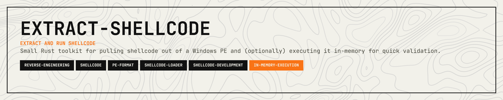

<p align="center">
  
</p>

<p align="center">
  <a href="https://crates.io/crates/extract-shellcode"></a>
  <a href="https://www.microsoft.com/windows"></a>
  <a href="https://opensource.org/licenses/MIT"></a>
  <a href="https://github.com/woldp001/guerrillamail-client-rs/pulls"></a>
</p>

<p align="center">
  <a href="#components">Components</a> · <a href="#prerequisites">Prerequisites</a> · <a href="#building">Building</a> · <a href="#usage">Usage</a> · <a href="#notes-and-limitations">Notes &amp; Limitations</a> · <a href="#contributing">Contributing</a> · <a href="#support">Support</a> · <a href="#license">License</a>
</p>

---

## Components
- `extract-shellcode`: reads a PE, finds the `.text` section, and uses a linker map file to decide how many bytes to keep.
- `test-shellcode`: loads a binary blob, allocates executable memory with `VirtualAlloc` on Windows, and jumps to it.

## Prerequisites
- Rust toolchain (edition 2024).
- Windows for `test-shellcode` execution (other platforms bail out).
- A PE executable and its corresponding `.map` file; the map line for `.text` should look like `0001:00000000 00000XXXH .text CODE`.

## Instalation
```
cargo install extract-shellcode
```

## Building
```bash
cargo build
```

## Usage
Extract shellcode from a PE using its map file:
```bash
cargo run --bin extract-shellcode -- -e path\\to\\program.exe -m path\\to\\program.map -o shellcode.bin
```

Inspect and execute a shellcode blob (Windows only):
```bash
cargo run --bin test-shellcode -- -i shellcode.bin
```
The runner prints the byte count and first few bytes before executing. Execution uses RWX pages; use only in a controlled environment.

## Notes and limitations
- The extractor looks for the first `.text` section named exactly `.text` and trusts the map file length; malformed inputs will error out.
- The tester does not apply mitigations (no DEP/CFG bypass), so only run known-safe shellcode.
- CI/tests are not provided; use `cargo clippy` and `cargo fmt` locally if desired.

## Contributing

Contributions are welcome! Please feel free to submit a Pull Request.

1. Fork the repository
2. Create your feature branch (`git checkout -b feature/cool-feature`)
3. Commit your changes (`git commit -m 'Add some cool feature'`)
4. Push to the branch (`git push origin feature/cool-feature`)
5. Open a Pull Request

## Support

If this crate saves you time or helps your work, support is appreciated:

[](https://ko-fi.com/11philip22)

## License

This project is licensed under the MIT License; see the [license](https://opensource.org/licenses/MIT) for details.
